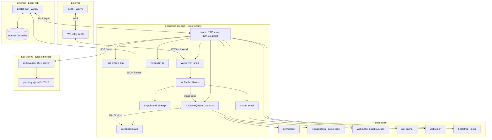

# Design — OneCipher Web UI Approval

> Spec dir: `specs/webui-approval/`
> Companion doc: `docs/webui-approval-design.md` (human-readable full design)
> Source of truth: `specs/webui-approval/features/*.feature` (BDD)

## 1. Summary

### Problem

OneCipher's daemon receives WalletConnect v2 signing requests from browser
dApps but currently signs them implicitly (or via TUI/CLI). Users have no
browser-based approval surface comparable to JoyID or Rabby — no way to
review transaction details, assess risk, and approve/reject from the same
browser context that the dApp lives in.

### Solution

Add a locally-served Web UI to the `onecipher` daemon. The UI is built with
Leptos CSR (compiled to WASM, embedded via `rust-embed`), served by axum on
a loopback-only HTTP listener, and authenticated via browser-native WebAuthn
Passkey. Signing requests from `WcMethodRouter::handle` are intercepted
before `forward()`, graded by `oc-policy` (Allow/Warn/Deny → Safe/Warning/
Danger/Forbidden), optionally simulated by local `evm2` (replaces Rabby's
cloud `preExecTx`), and routed through an `mpsc`+`oneshot` approval channel
to the browser. The user reviews, acknowledges warnings, and confirms via a
two-step Sign-button state machine. Approval queue state is persisted to
`approval_queue.jsonl` for daemon-restart recovery.

### Scope

In scope:
- New crate `oc-webui` (axum router + approval queue + WebAuthn + rust-embed)
- New crate `oc-sim` (evm2 simulation, EVM chains only)
- `oc-netagent` additions: `ApprovalChannel`/`PendingApproval`/`ApprovalDecision` types + `WcMethodRouter` injection
- `oc-policy` extension: `Decision::Warn` variant + 11-step wired to signing methods
- `oc-cli` `webui open` command + daemon-side `run_webui_server`
- Front-end Leptos CSR project under `oc-webui/frontend/`
- R12 revision (source-level isolation, loopback-only listener)
- `AGENTS.md` R12 section update

Out of scope:
- Mobile/native app
- dApp injection / content-script provider (WC v2 is the only bridge)
- TLS termination (loopback HTTP is a secure context)
- Replacing the existing TUI or CLI `wc` commands
- Multi-user / remote-access (loopback only)

### EARS Notation

- **Ubiquitous:** The daemon MUST serve the Web UI on a loopback-only HTTP listener.
- **State-driven:** WHEN a signing method is received via WC v2 AND approval_mode is true, the daemon MUST surface a PendingApproval to the Web UI.
- **Event-driven:** WHEN the user approves a PendingApproval, the daemon MUST forward the original request to Key-Agent and return the signature to the dApp.
- **Optional:** The daemon MAY run `evm2` simulation on EVM-chain SignTransaction requests to populate `TxSimulation`.
- **Unwanted:** IF a non-loopback bind address is configured, THEN the daemon MUST reject the bind and refuse to start the Web UI server.

## 2. Approach

### Ponytail Ladder Application

The design follows YAGNI → stdlib → native → existing dep → one-liner → minimum code:

1. **YAGNI:** No mobile, no TLS, no multi-user, no dApp injection. No policy
   Prompt variant (existing `Allow`/`Deny` + new `Warn` suffices).
2. **stdlib:** `tokio::sync::{mpsc, oneshot}` for approval channel (not a
   custom queue abstraction). `std::sync::Arc<AtomicBool>` for approval_mode.
3. **native:** Leptos CSR compiles to WASM natively in the Rust workspace;
   no Node toolchain for the front-end (Trunk is the only build tool).
4. **existing dep:** `axum` 0.8.9 (already in `Cargo.lock`), `tokio` (already
   pervasive), `rust-embed` (new but minimal), `webauthn-rs` (mature).
5. **one-liner:** `rust-embed` embeds `dist/` in one `RustEmbed` derive.
6. **minimum code:** `oc-webui` exposes a single `run_webui_server()` entry
   point; daemon calls it in one `tokio::spawn`.

### Abductive Refinement (rejected alternatives)

**Alternative A: Topcoat (tokio-rs) instead of Leptos CSR.**
- Interpretation: Topcoat is an SSR-first framework where `$(...)` compiles
  to JS and the server owns rendering.
- Rejected because: Topcoat is experimental ("Expect breaking changes"), and
  its "I am the server" model conflicts with the existing WC server + daemon
  control UDS. Leptos CSR leaves the daemon as server owner.

**Alternative B: Path B (reuse existing Ed25519 PasskeyPubkeyStore for browser auth).**
- Interpretation: Use the existing `~/.onecipher/passkeys.json` Ed25519 store
  for browser-side Passkey auth via WebCrypto.
- Rejected because: WebCrypto cannot persist non-extractable Ed25519 keys
  across sessions. Browser-native WebAuthn (ES256/RS256, COSE format) is the
  only robust option. The two registries are kept separate; Key-Agent still
  trusts only the Ed25519 store.

**Alternative C: `revm` instead of `evm2` for simulation.**
- Interpretation: Use the established `revm` crate.
- Rejected because: User explicitly chose `alloy-rs/evm2` (revm's successor
  by the alloy team, ~2x faster). Risk mitigation: git pin, feature
  pruning, abstraction in `oc-sim`.

### Risk Mitigations

| Risk | Mitigation |
|---|---|
| `evm2` not on crates.io, frequent breaking changes | git pin to specific commit; `default-features=false` with only `["std","parse","asm-keccak"]`; abstracted behind `oc-sim::simulate_evm_tx` so swapping back to `revm` only touches `oc-sim` |
| `evm2` pulls heavy precompile deps (`gmp-mpfr-sys`, `mcl_rust`, `blst`, `c-kzg`, `ark-bn254`, `p256`) | feature pruning; precompiles disabled (not needed for mainnet EVM contract simulation) |
| R56 violation (async/network deps leaking into isolated crates) | All new deps only in `oc-webui`, `oc-sim`, `oc-cli`; verified via `cargo tree -p <isolated>` commands in CI |
| R12 binary-symbol check is broken (binary stripped, `nm | grep tcp` returns nothing) | R12 revised to source-level grep + runtime `lsof` + T12 seccomp enforcement |
| WebAuthn first-time bootstrap trust | One-time bootstrap token (32 bytes random, 5-min TTL, single-use), written to `~/.onecipher/bootstrap_token` mode 0600, consumed by `onecipher webui open` |
| Approval queue loss on daemon restart | Append-only `approval_queue.jsonl` + startup replay (Rabby does NOT do this; OneCipher should be better) |
| Multi-tab double-decide | `DashMap<uuid, oneshot::Sender>` — first `send` wins, second returns HTTP 409; WebSocket broadcasts `approval_resolved` to sync other tabs |

## 3. Architecture Decisions (MADR)

### ADR-1: Leptos CSR + axum + rust-embed

**Context:** The Web UI must be served by the existing `onecipher` daemon
without introducing a Node toolchain, must integrate with the existing
tokio runtime + WC server + UDS control socket, and must be offline-capable.

**Decision:** Use Leptos CSR (compiled to WASM, embedded via `rust-embed`)
served by axum on a loopback HTTP listener. The daemon remains the server
owner; the front-end is a static asset bundle.

**Consequences:**
- Pro: Single Rust binary; no Node toolchain; daemon keeps ownership of the
  HTTP surface; R56 unaffected (deps only in `oc-webui`).
- Con: WASM bundle adds ~150-300KB to binary; first-load latency on cold
  cache.
- Con: Leptos CSR ecosystem smaller than React, but adequate for this scope.

### ADR-2: Browser-native WebAuthn via webauthn-rs (Path A)

**Context:** Web UI needs authentication. Existing OneCipher Passkey is a
custom Ed25519 challenge-response for dApp-side auth; WebCrypto cannot
persist Ed25519 keys across sessions for browser-side use.

**Decision:** Use `webauthn-rs` with a separate registry
`~/.onecipher/webauthn_passkeys.json`. The existing Ed25519
`PasskeyPubkeyStore` is untouched; Key-Agent still trusts only it.

**Consequences:**
- Pro: Browser-native UX (Face ID/Touch ID/security key); no passphrase;
  mature crate.
- Con: Two Passkey registries (acceptable: different trust domains — browser
  UI auth vs. dApp-side signing auth).
- Con: First-time registration needs bootstrap trust (one-time token).

### ADR-3: Local evm2 simulation replaces cloud preExecTx

**Context:** Rabby's `parseTx` (calldata decoding) and `preExecTx` (state
simulation) are cloud API calls. OneCipher is offline-first and cannot
depend on a cloud backend.

**Decision:** Add crate `oc-sim` that wraps `evm2` (alloy-rs/evm2, git pin,
feature-pruned) and exposes `simulate_evm_tx(raw_tx, chain_id) ->
Result<TxSimulation>`. ABI decoding uses a local cache
(`~/.onecipher/abi_cache/`) with curated defaults; optional `abi-fetch`
feature for Etherscan (off by default).

**Consequences:**
- Pro: Fully offline; no cloud dependency; single-version (no `v0`/`v1`/
  `v2` like Rabby).
- Pro: `evm2` handles nonce-conflict natively (no `pending_tx_list`
  forwarding needed).
- Con: `evm2` is not on crates.io (git pin required); risk of upstream
  breaking changes (mitigated by abstraction in `oc-sim`).
- Con: Binary size increases ~5-10MB from `evm2` deps even with feature
  pruning.

### ADR-4: Approval queue via mpsc + oneshot (not closure capture)

**Context:** Rabby's `notification.ts` uses closure-captured
`resolve`/`reject` promises on approval objects (MV3-specific). OneCipher's
daemon is a long-lived tokio process.

**Decision:** Use `tokio::sync::mpsc::Sender<(PendingApproval,
oneshot::Sender<ApprovalDecision>)>` from `WcMethodRouter` to
`ApprovalQueue`. `WcMethodRouter::handle` awaits the `oneshot::Receiver`
with `tokio::time::timeout`.

**Consequences:**
- Pro: Idiomatic Rust; no closure-capture lifetime issues; natural timeout
  via `tokio::time::timeout`.
- Pro: Multiple concurrent pending approvals supported (Rabby serializes
  per-page; OneCipher need not).

### ADR-5: Risk grading via oc-policy::Decision::Warn

**Context:** Rabby uses 4 risk levels (FORBIDDEN/DANGER/WARNING/safe) from
a separate Security Engine. OneCipher already has a Policy Engine v2/v3
with `Decision::{Allow, Deny}`.

**Decision:** Add `Decision::Warn(WarnReason)` variant to `oc-policy`.
`WcMethodRouter` maps `Deny → Forbidden (immediate reject)`, `Warn →
Warning (queue + ack-gated)`, `Allow → Safe (queue only if approval_mode
on)`. evm2 simulation revert escalates to `Danger`.

**Consequences:**
- Pro: Single source of risk (Policy Engine); no separate Security Engine.
- Con: Existing 11-step evaluation is wired only to `PayX402`; must be
  extended to `SignTransaction`/`SignMessage`/`SignTypedData`/`SignUserOp`.

### ADR-6: R12 revision (source-level + runtime, not symbol-level)

**Context:** Current R12 (`nm | grep -i tcp` on release binary) is broken
because the binary is stripped — it returns nothing even though
`strings | grep TcpStream` already matches 1 line from `hpx-yawc` WSS
client. Adding a loopback `TcpListener` makes the situation no worse.

**Decision:** Revise R12 into R12a-R12e: source-level grep for
`TcpListener`/`TcpStream` in isolated crates; daemon MAY contain TCP
symbols; `TcpListener` MUST bind `127.0.0.1`; T12 seccomp enforces
loopback-only at runtime.

**Consequences:**
- Pro: Verification is real (not false-negative); runtime enforcement is
  robust against source tampering.
- Con: `AGENTS.md` R12 section must be updated; existing CI scripts
  referencing `nm | grep tcp` must be updated.

## 4. BDD/TDD Strategy

### Source of truth

`specs/webui-approval/features/*.feature` — Gherkin scenarios tagged
`@w1-*`, `@w2-*`, `@w3-*`, `@w4-*` for phased delivery traceability.

### Feature inventory

| File | Scenarios | Phase coverage |
|---|---|---|
| `approval_flow.feature` | 17 | W1 (mode switch, approve/reject/timeout, multi-tab, persistence, WebAuthn, auto-lock, R12) |
| `risk_gate.feature` | 11 | W2 (policy deny/warn, ack-gate, danger countdown, sim-revert, two-step, colors) + W3 (sim results) |
| `frontend_cache.feature` | 12 | W4 (cache fresh/stale/empty, invalidate-on-event, SortHat, persistent mount, theme, i18n) |
| `api_surface.feature` | 16 | W1 (health, settings, WS) + W4 (wallets, WC, audit, policy, session keys, secrets) |

### TDD inner loop

- **Crate-local unit tests** drive implementation (colocated `#[cfg(test)]`).
- **Proptest** for invariant checking: e.g. approval_queue.jsonl replay must
  preserve all `pending` events without a matching `resolved`.
- **Conformance BDD** in `crates/oc-conformance/tests/conformance/steps/`
  covers the end-to-end flows (daemon + WC relay mock + browser-equivalent
  client). Step definitions stay thin; business logic routes through shared
  crates.

### Test pyramid

- Unit (colocated): approval channel, risk mapping, ABI decoding, cache
  freshness, SortHat state transitions.
- Integration (crate-level `tests/`): `oc-webui` axum router with mock
  Key-Agent UDS; `oc-sim` with curated ABI cache.
- Conformance (BDD): end-to-end approval flow with mock WC relay.

## 5. Verification

### Per-task verification (machine-checkable)

Each task in `tasks.md` lists exact commands and expected outputs. The
workspace-level verification suite is:

```bash
# Format (requires nightly rustfmt)
cargo +nightly fmt --all -- --check

# Clippy (pedantic + nursery, warnings are errors)
RUSTC_WRAPPER= cargo +nightly clippy --all -- -D warnings

# All unit + integration tests (exclude slow BDD)
cargo test --workspace --exclude oc-conformance

# Conformance BDD scenarios (cucumber-driven)
cargo test -p oc-conformance --test conformance -- webui_approval
cargo test -p oc-conformance --test conformance -- risk_gate
cargo test -p oc-conformance --test conformance -- frontend_cache
cargo test -p oc-conformance --test conformance -- api_surface

# Full test suite
cargo test --workspace --all-features

# R56 hard gate — no forbidden deps in isolated crates
cargo tree -p oc-crypto      | grep -E 'evm2|axum|hyper|tower|rust-embed|webauthn'
cargo tree -p oc-policy      | grep -E 'evm2|axum|hyper|tower|rust-embed|webauthn'
cargo tree -p oc-keyagent    | grep -E 'evm2|axum|hyper|tower|rust-embed|webauthn'
cargo tree -p oc-session-key | grep -E 'evm2|axum|hyper|tower|rust-embed|webauthn'
# Expected: no output from any of the four

# R12a — source-level (replaces broken nm check)
rg -n 'TcpListener|TcpStream' crates/oc-keyagent/src/ crates/oc-crypto/src/ \
                              crates/oc-policy/src/ crates/oc-session-key/src/
# Expected: no matches (exit code 1)

# R12c — runtime listener check
cargo build --release --bin onecipher
./target/release/onecipher daemon &
sleep 2
lsof -iTCP -sTCP:LISTEN -P -n | grep onecipher
# Expected: only 127.0.0.1:* entries
kill %1

# Build the front-end (Trunk must be installed)
cd crates/oc-webui/frontend && trunk build --release
# Expected: dist/index.html + dist/pkg/*.wasm generated

# Daemon serves the front-end
curl -s http://127.0.0.1:<port>/api/health | grep '"ok":true'
curl -s http://127.0.0.1:<port>/ | grep '<html'
```

### Justfile integration

Add to `Justfile`:

```makefile
webui-build:
    cd crates/oc-webui/frontend && trunk build --release

webui-serve: webui-build
    cargo run --bin onecipher -- daemon

bdd-webui:
    cargo test -p oc-conformance --test conformance -- webui_approval risk_gate frontend_cache api_surface
```

## 6. Data Model (optional — non-trivial)

### `~/.onecipher/config.toml` (new `[webui]` section)

```toml
[webui]
enabled = true
approval_mode = false
approval_timeout_secs = 300
listen = "127.0.0.1:0"
session_timeout_secs = 1800
auto_lock_at = ""
```

### `~/.onecipher/logs/approval_queue.jsonl` (new, append-only, mode 0600)

```jsonl
{"event":"pending","id":"<uuid>","at":<unix>,"approval":{...PendingApproval...}}
{"event":"resolved","id":"<uuid>","at":<unix>,"decision":"approved|rejected|timeout","reason":"..."}
```

### `~/.onecipher/webauthn_passkeys.json` (new, mode 0600)

```json
{
  "version": 1,
  "credentials": [
    { "id": "<base64>", "pubkey": "<COSE>", "created_at": <unix> }
  ]
}
```

### `~/.onecipher/bootstrap_token` (new, mode 0600, 5-min TTL)

Plain text, 32-byte base64url-encoded token.

### `~/.onecipher/abi_cache/<address>.json` (new, mode 0600, per-address ABI)

```json
{ "address": "0x...", "abi": [...], "fetched_at": <unix> }
```

### `~/.onecipher/webui.port` (new, mode 0600)

Plain text, the actual bound port (random when `listen = 127.0.0.1:0`).

## 7. Topology (optional — C4 diagram)



## 8. Code Simplification Constraints

- **Ponytail mode:** YAGNI → stdlib → native → existing dep → one-liner → minimum code.
- No mobile, no TLS, no multi-user, no dApp injection.
- No custom queue abstractions — `tokio::sync::{mpsc, oneshot}` suffices.
- No Node toolchain — Leptos CSR compiles to WASM natively via Trunk.
- `rust-embed` for static asset embedding (one derive macro).
- `oc-webui` exposes a single `run_webui_server()` entry point.
- No separate Security Engine — `oc-policy` is the single risk source.
- Approval queue uses `DashMap` + `oneshot` — no closure-capture patterns.
- ABI decoding uses curated local cache — no mandatory cloud fetch.

## 9. BDD Scenario Inventory

| File | Count | Phase Tags |
|---|---|---|
| `approval_flow.feature` | 17 | `@w1-approval-mode-off`, `@w1-approval-mode-on`, `@w1-approve`, `@w1-reject`, `@w1-timeout`, `@w1-multi-tab`, `@w1-non-signing-bypass`, `@w1-persist-pending`, `@w1-persist-resolved-gc`, `@w1-bootstrap-token`, `@w1-bootstrap-expired`, `@w1-webauthn-register`, `@w1-webauthn-login`, `@w1-webauthn-session-missing`, `@w1-auto-lock-deadline`, `@w1-auto-lock-fire`, `@w1-auto-lock-warning`, `@w1-activity-extends`, `@w1-r12-source-isolation`, `@w1-r12-loopback-only` |
| `risk_gate.feature` | 11 | `@w2-policy-deny-forbidden`, `@w2-policy-warn`, `@w2-policy-warn-ack`, `@w2-danger-countdown`, `@w2-forbidden-hides-sign`, `@w2-two-step-cancel`, `@w2-two-step-confirm`, `@w2-color-mapping`, `@w2-sim-revert-danger`, `@w3-sim-balance-change`, `@w3-sim-failure-degrade`, `@w3-sim-gas-used`, `@w3-sim-decoded-action` |
| `frontend_cache.feature` | 12 | `@w4-sort-hat-*`, `@w4-cache-*`, `@w4-invalidate-*`, `@w4-persistent-mount-*`, `@w4-theme-*`, `@w4-i18n-*` |
| `api_surface.feature` | 16 | `@w1-health`, `@w1-settings-*`, `@w1-ws-*`, `@w4-wallets-*`, `@w4-wc-*`, `@w4-audit-*`, `@w4-policy-*`, `@w4-session-keys-*`, `@w4-secrets-*` |

## 10. Existing Components to Reuse

| Component | Crate | Used For |
|---|---|---|
| `oc-policy::v2::Decision` | `oc-policy` | Risk grading (Allow/Warn/Deny) |
| `oc-policy` 11-step evaluation | `oc-policy` | Pre-signing risk assessment |
| `oc_core::config` | `oc-core` | Config parsing (`config.toml`) |
| `oc_keyagent::frame` | `oc-keyagent` | UDS length-prefixed prost frames to Key-Agent |
| `oc_netagent::WcMethodRouter` | `oc-netagent` | WC v2 method dispatch |
| `oc_netagent::WcServerHandle` | `oc-netagent` | WC session management |
| `oc_crypto::HardenedBytes` | `oc-crypto` | Sensitive material handling |
| `tokio::sync::{mpsc, oneshot}` | `tokio` | Approval channel (no custom abstraction) |
| `axum` 0.8.9 | workspace | HTTP server (already in Cargo.lock) |
| `webauthn-rs` | workspace | Browser-native Passkey auth |
| `rust-embed` | new (minimal) | WASM + static asset embedding |
| `DashMap` | workspace | In-memory concurrent maps |

## 11. Open Questions

None. All design decisions confirmed in the conversation preceding this
spec (Sections 1-7 of `docs/webui-approval-design.md`).
